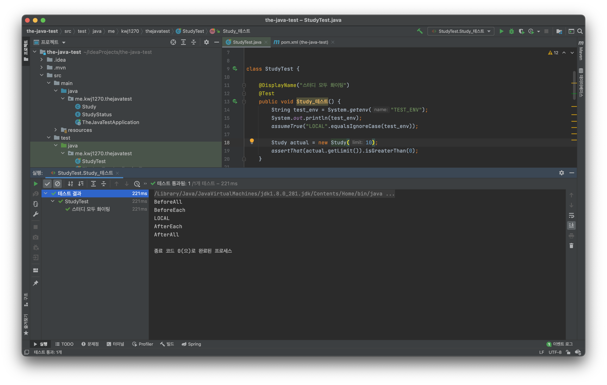
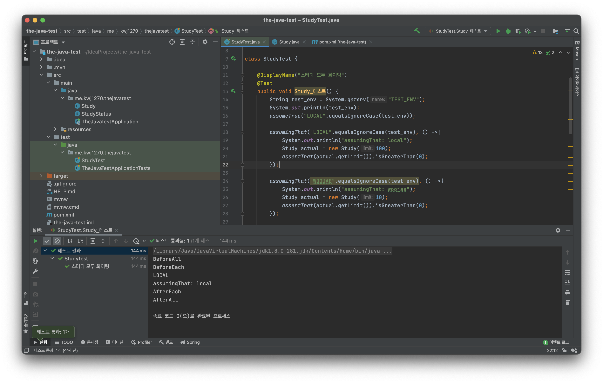
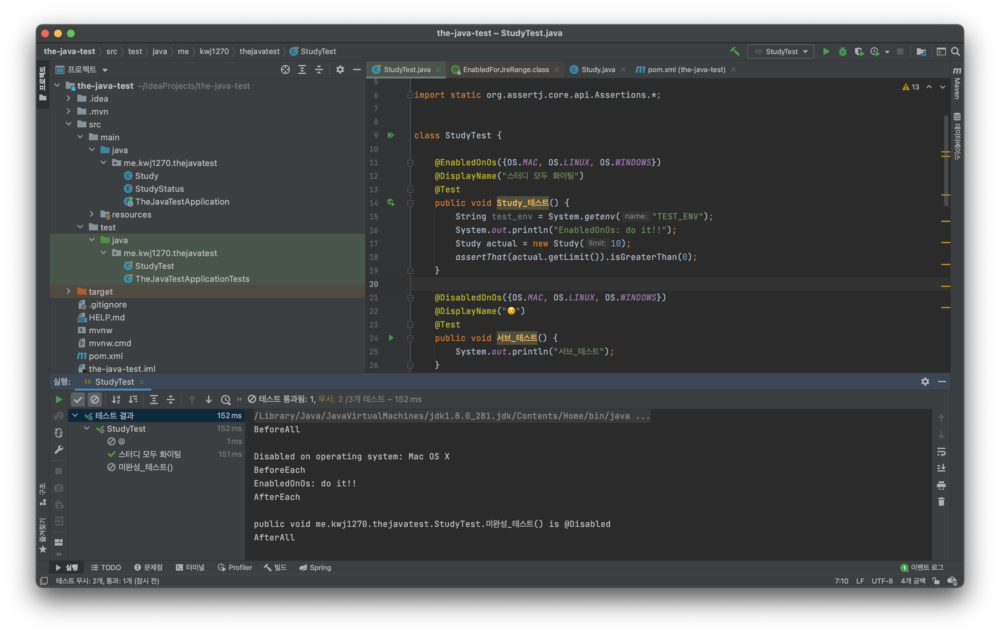

# JUnit5 조건에 따라 테스트 실행하기    

특정한 조건을 만족하는 경우에 테스트를 실행하는 방법 
즉, 조건에 따라 테스트를 실행하는 방법      

예를 들면 `특정 OS`, `특정 JDK 버전`, `특정 환경 변수`, `특정 시스템 변수`에 따라    
실행하거나 실행하지 말아야 되는 경우 이를 `assume-` 메서드를 통해 해결할 수 있다.      

* **`org.junit.jupiter.api.Assumptions.*`**
    * `import static`을 사용해야 한다.  
    * assumeTrue(boolean assumption);    
    * assumingThat(BooleanSupplier assumptionSupplier, Executable executable)      
       
* **`@Enabled___`** 와 **`@Disabled___`**    
    * OnOs
    * OnJre
    * IfSystemProperty
    * IfEnvironmentVariable
 
# assumeTrue   
```java
assumeTrue(boolean assumption);
```
`assumeTrue()`는 assumption의 조건이 맞지 않다면, 테스트를 실패시키고       
assumption의 조건이 맞는다면, 아래에 존재하는 소스코드를 실행시킨다.     
   
앞서 말했듯이 `특정 OS`, `특정 JDK 버전`, `특정 환경 변수`, `특정 시스템 변수`에 따라       
실행하거나 실행하지 말아야 되는 경우 이를 `assume-` 메서드를 통해 해결할 수 있다.       

```java
import org.junit.jupiter.api.*;

import static org.junit.jupiter.api.Assumptions.*;
import static org.assertj.core.api.Assertions.*;

class StudyTest {

    @DisplayName("스터디 모두 화이팅")
    @Test
    public void Study_테스트() {
        String test_env = System.getenv("TEST_ENV");
        System.out.println(test_env);
        assumeTrue("LOCAL".equalsIgnoreCase(test_env));
        
        Study actual = new Study(10);
        assertThat(actual.getLimit()).isGreaterThan(0);
    }
    
}
```
     
   
필자같은 경우 `TEST_ENV` 환경변수 자체를 셋팅해본 적이 없어서        
`NULL`이라는 값이 리턴되어, 테스트에 실패하게 된 것을 알 수 있다.       
정확히 말하면, `assume-` 메서드는 조건이 맞지 않을 경우 해당 테스트를 무시한다.   
    
**🛠 그럼 이제 테스트가 정상적으로 동작할 수 있도록 조금만 손을 보자**      
> 필자가 현재 MAC OS 및 Oh-my-zsh를 사용하기에 이에 기준을 맞춰서 설명을 하겠습니다.       
          
IntelliJ의 `terminal`에 들어간 후 `vim ~/.zshrc`을 입력한다. (zsh설치 되어있어야함)     

**.zshrc(zsh 설정파일)**
```zshrc
# 생략..

export TEST_ENV=LOCAL

# 생략..
```   
`.zshrc` 설정파일에 `export TEST_ENV=LOCAL`을 입력해준다.                   
이후, IntelliJ를 **완전 종료 후 다시 재 구동**해야만 변경된 환경이 적용된다.           
확인을 위해 IntelliJ terminal에서 `echo $TEST_ENV`을 입력하면 `LOCAL`이 나오는지 확인한다.     
       
이후, 기존 코드 그대로 테스트를 실행하면 아래와 같이 테스트가 성공하는 것을 알 수 있다.   
     
    
    
  
# assumingThat
```java
assumingThat(BooleanSupplier assumptionSupplier, Executable executable)
```        
`assumingThat()`은 마치 if구문과 비슷하다.            
해당 조건에 맞으면 `Executable executable`에서 정의한 소스코드를 실행시킨다.          
    
그리고, `assumeTrue`와 다르게 조건이 맞지 않아도 테스트를 계속 수행한다.          
단지, `Executable executable`에서 정의한 소스코드를 실행시키지 않을 뿐이다.   

```java
import org.junit.jupiter.api.*;

import static org.junit.jupiter.api.Assumptions.*;
import static org.assertj.core.api.Assertions.*;


class StudyTest {

    @DisplayName("스터디 모두 화이팅")
    @Test
    public void Study_테스트() {
        String test_env = System.getenv("TEST_ENV");
        System.out.println(test_env);
        assumeTrue("LOCAL".equalsIgnoreCase(test_env));

        assumingThat("LOCAL".equalsIgnoreCase(test_env), () ->{
            System.out.println("assumingThat: local");
            Study actual = new Study(100);
            assertThat(actual.getLimit()).isGreaterThan(0);
        });

        assumingThat("WOOJAE".equalsIgnoreCase(test_env), () ->{
            System.out.println("assumingThat: woojae");
            Study actual = new Study(10);
            assertThat(actual.getLimit()).isGreaterThan(0);
        });

    }
}
```
   
  
현재 `TEST_ENV`의 값은 `LOCAL`이기 때문에        
`assumingThat: local`이 호출된 것을 알 수 있다.   

# @Enabled___ AND @Disabled___  
## @Enabled___ With EnabledOnOS
`@Enabled___` 로 시작하는 어노테이션을 테스트 메서드에 기입하면,   
`()`안에 조건이 맞아야 해당 테스트 메서드를 수행시킨다.   


```java
import org.junit.jupiter.api.*;
import org.junit.jupiter.api.condition.DisabledOnOs;
import org.junit.jupiter.api.condition.EnabledOnOs;
import org.junit.jupiter.api.condition.OS;

import static org.assertj.core.api.Assertions.*;


class StudyTest {

    @EnabledOnOs(OS.MAC)
    @DisplayName("스터디 모두 화이팅")
    @Test
    public void Study_테스트() {
        String test_env = System.getenv("TEST_ENV");
        System.out.println("EnabledOnOs: do it!!");
        Study actual = new Study(10);
        assertThat(actual.getLimit()).isGreaterThan(0);
    }
}
```
    
  
* 현재 필자의 환경은 Mac이여서 테스트가 성공적으로 수행되었다.   

```java
import org.junit.jupiter.api.*;
import org.junit.jupiter.api.condition.DisabledOnOs;
import org.junit.jupiter.api.condition.EnabledOnOs;
import org.junit.jupiter.api.condition.OS;

import static org.assertj.core.api.Assertions.*;


class StudyTest {

    @EnabledOnOs({OS.MAC, OS.LINUX, OS.WINDOWS})
    @DisplayName("스터디 모두 화이팅")
    @Test
    public void Study_테스트() {
        String test_env = System.getenv("TEST_ENV");
        System.out.println("EnabledOnOs: do it!!");
        Study actual = new Study(10);
        assertThat(actual.getLimit()).isGreaterThan(0);
    }

}

```
* 어노테이션마다 다르지만,     
@EnabledOnOs의 같은 경우는 `()`의 값에는 하나가 아닌 여러 멤버들을 넣을 수 있다.          

## @Disabled___ With EnabledOnOS
`@Disabled___`로 시작하는 어노테이션들은 `@Enabled___` 과 정반대로   
테스트 메서드에 기입하면, `()`안에 조건이 맞으면 해당 테스트 메서드를 실행시키지 않는다.      
   
```java
import org.junit.jupiter.api.*;
import org.junit.jupiter.api.condition.DisabledOnOs;
import org.junit.jupiter.api.condition.EnabledOnOs;
import org.junit.jupiter.api.condition.OS;

import static org.assertj.core.api.Assertions.*;


class StudyTest {

    @EnabledOnOs({OS.MAC, OS.LINUX, OS.WINDOWS})
    @DisplayName("스터디 모두 화이팅")
    @Test
    public void Study_테스트() {
        String test_env = System.getenv("TEST_ENV");
        System.out.println("EnabledOnOs: do it!!");
        Study actual = new Study(10);
        assertThat(actual.getLimit()).isGreaterThan(0);
    }

    @DisabledOnOs({OS.MAC, OS.LINUX, OS.WINDOWS})
    @DisplayName("☺️")
    @Test
    public void 서브_테스트() {
        System.out.println("서브_테스트");
    }

}
```

    

* 콘솔창을 보면 `Disabled on operating system: Mac OS X` 메시지가 출력된 것이 보인다.   
* `서브_테스트()`에 `@DisabledOnOs({OS.MAC, OS.LINUX, OS.WINDOWS})`를 넣었기에 실행이 되지 않았기 때문이다.  

## EnabledOnJRE AND DisAbledOnJRE
```java
import org.junit.jupiter.api.*;
import org.junit.jupiter.api.condition.*;

import static org.assertj.core.api.Assertions.*;


class StudyTest {

    @EnabledOnJre({JRE.JAVA_9, JRE.JAVA_10, JRE.JAVA_11})
    @DisplayName("스터디 모두 화이팅")
    @Test
    public void Study_테스트() {
        String test_env = System.getenv("TEST_ENV");
        System.out.println("EnabledOnOs: do it!!");
        Study actual = new Study(10);
        assertThat(actual.getLimit()).isGreaterThan(0);
    }

    @DisabledOnJre(JRE.JAVA_8)
    @DisplayName("☺️")
    @Test
    public void 서브_테스트() {
        System.out.println("서브_테스트");
    }

    @Disabled
    @Test
    public void 미완성_테스트() {
        System.out.println("미완성_테스트");
    }

    @BeforeAll
    static void BeforeAll_테스트() {
        System.out.println("BeforeAll");
    }

    @BeforeEach
    public void BeforeEach_테스트() {
        System.out.println("BeforeEach");
    }

    @AfterEach
    public void AfterEach_테스트() {
        System.out.println("AfterEach");
    }

    @AfterAll
    static void AfterAll_테스트() {
        System.out.println("AfterAll");
    }


}
```
