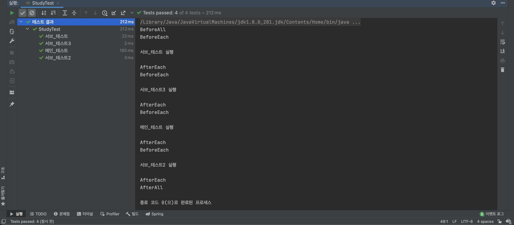

# JUnit5 테스트 순서      
     
JUnit5 에서는 테스트 메서드를 정의한 순서대로 실행하도록 내부 로직이 정의되어있다.             
단, 정의한 순서대로 실행되기는 하지만, 우리가 그 순서에 의존해서는 안 된다.          
왜냐하면 이 순서는 JUnit 내부 구현 로직에 따라 언제든지 바뀔 가능성이 있기 때문이다.         
      
**🤔 그렇다면 왜? 기본 설정으로 테스트 메서드의 순서를 명확하게 드러내지 않은 것일까?**          
          
우리가 실행하는 것은 **단위 테스트**임을 기억하자             
사실, 단위 테스트는 다른 단위 테스트와 독립적으로 실행가능해야한다.          
즉, 서로간의 의존성이 없어야하며 다른 테스트 코드에 영향을 주면 안 된다.        
그렇기 때문에 단위 테스트 순서를 중요하게 생각하면 안 되고, 순서에 의존하면 안 된다.       
                                
**하지만, `Integration Test`, `Functional Test`, `Scenario Test`와 같이                   
경우에 따라서는 내가 원하는 순서대로 테스트를 작성하고 싶을 때가 있다.**                   
예를 들면, **`회원가입`**`->`**`로그인`**`->`**`마이페이지`**`->`**`닉네임 변경`** 와 같은 유스케이스를 테스트를 하는 경우,     
순차적으로 유스케이스를 나누어서 각각의 테스트 케이스를 생성하고,        
사용되는 자원들을 `state full` 하게 상태 정보를 유지하면서             
테스트 메서드간에 의존성도 있고, 서로 데이터도 공유하는 방식으로 작성해야한다.               
이 같은 경우, **테스트 인스턴스를 하나만 만들어 서로 의존하면서 사용하게끔 만들어야 한다.**          

# @MethodOrderer     
앞서 언급한 대로 경우에 따라, 특정 순서대로 테스트를 실행하고 싶을 때도 있다.       
그 경우에는 `@TestInstance(Lifecycle.PER_CLASS)`와 함께 `@TestMethodOrder`를 사용하면 된다.        
       
`@TestMethodOrder`의 멤버값으로 `MethodOrderer` 구현체를 설정해줘야 한다.          
사용법으로는 `@TestMethodOrder(MethodOrderer.구현체이름.class)`와 같이 정의해주면 된다.       
    
|MethodOrderer 기본 구현체|설명|
|----------------------|---|    
|MethodOrderer.MethodName|원본 메서드의 이름을 기준 및 알파벳,숫자순으로 실행 순서를 조율한다.<br>`Alphanumeric`을 대체하기 위해 나왔다.|   
|MethodOrderer.DisplayName|Display에 표현되는 메서드의 이름을 기준 및 알파벳,숫자순으로 실행 순서를 조율한다.<br>즉, `@DisplayName`을 기준으로 순서를 조율하고, `@DisplayName`이 없으면 원래 메서드 이름이 비교대상이 된다.<br>`Alphanumeric`을 대체하기 위해 나왔다.|     
|MethodOrderer.OrderAnnoation|`@Order`어노테이션을 통해 테스트 순서를 조율한다.<br>단, 스프링의 `@Order`이 아니고 Junit이 제공하는 `@Order`이다.<br>우선 순위를 주는 것이기에 값이 낮을 수록 더 먼저 실행된다.|   
|MethodOrderer.Random||      
|MethodOrderer.Alphanumeric|메서드의 알파벳, 숫자순으로 실행 순서를 조율한다.<br>`String.compareTo(String)`와 동일하다고 보면된다.<br>현재 `@Deprecated`로 정의되어 사용을 권장하지는 않는다.|

## OrderAnnoation 과 @Order    
`MethodOrderer.OrderAnnoation`는 `@Order`에 멤버값이 작은 순서대로 메서드를 실행한다.         

```java
package me.kwj1270.thejavatest;

import org.junit.jupiter.api.*;
import org.junit.jupiter.api.extension.ParameterContext;
import org.junit.jupiter.params.aggregator.ArgumentsAccessor;
import org.junit.jupiter.params.aggregator.ArgumentsAggregationException;
import org.junit.jupiter.params.aggregator.ArgumentsAggregator;
import org.junit.jupiter.params.converter.ArgumentConversionException;
import org.junit.jupiter.params.converter.SimpleArgumentConverter;

import static org.assertj.core.api.Assertions.*;
import static org.junit.jupiter.api.Assertions.*;

@TestMethodOrder(MethodOrderer.OrderAnnotation.class)
@TestInstance(TestInstance.Lifecycle.PER_CLASS)
class StudyTest {

    int value = 0;

    @Order(1)
    @FastTest
    @DisplayName("메인_테스트")
    public void 메인_테스트() {
        Study actual = new Study(10);
        assertThat(actual.getLimit()).isGreaterThan(0);
        System.out.println("\n메인_테스트 실행\n");
    }

    @Order(2)
    @SlowTest
    @DisplayName("서브_테스트")
    public void 서브_테스트() {
        System.out.println("\n서브_테스트 실행\n");
    }

    @Order(3)
    @SlowTest
    @DisplayName("서브_테스트2")
    public void 서브_테스트2() {
        System.out.println("\n서브_테스트2 실행\n");
    }

    @BeforeAll
    void BeforeAll_테스트() {
        System.out.println("BeforeAll");
    }

    @BeforeEach
    public void BeforeEach_테스트() {
        System.out.println("BeforeEach");
    }

    @AfterEach
    public void AfterEach_테스트() {
        System.out.println("AfterEach");
    }

    @AfterAll
    void AfterAll_테스트() {
        System.out.println("AfterAll");
    }

}
```
우리가 사용하는 JUnit5의 디폴트 설정은 위와 비슷한 로직일 것이다.   

```java
package me.kwj1270.thejavatest;

import org.junit.jupiter.api.*;
import org.junit.jupiter.api.extension.ParameterContext;
import org.junit.jupiter.params.aggregator.ArgumentsAccessor;
import org.junit.jupiter.params.aggregator.ArgumentsAggregationException;
import org.junit.jupiter.params.aggregator.ArgumentsAggregator;
import org.junit.jupiter.params.converter.ArgumentConversionException;
import org.junit.jupiter.params.converter.SimpleArgumentConverter;

import static org.assertj.core.api.Assertions.*;
import static org.junit.jupiter.api.Assertions.*;

@TestMethodOrder(MethodOrderer.OrderAnnotation.class)
@TestInstance(TestInstance.Lifecycle.PER_CLASS)
class StudyTest {

    int value = 0;

    @Order(2)
    @FastTest
    @DisplayName("메인_테스트")
    public void 메인_테스트() {
        Study actual = new Study(10);
        assertThat(actual.getLimit()).isGreaterThan(0);
        System.out.println("\n메인_테스트 실행\n");
    }

    @Order(1)
    @SlowTest
    @DisplayName("서브_테스트")
    public void 서브_테스트() {
        System.out.println("\n서브_테스트 실행\n");
    }

    @Order(3)
    @SlowTest
    @DisplayName("서브_테스트2")
    public void 서브_테스트2() {
        System.out.println("\n서브_테스트2 실행\n");
    }

    @BeforeAll
    void BeforeAll_테스트() {
        System.out.println("BeforeAll");
    }

    @BeforeEach
    public void BeforeEach_테스트() {
        System.out.println("BeforeEach");
    }

    @AfterEach
    public void AfterEach_테스트() {
        System.out.println("AfterEach");
    }

    @AfterAll
    void AfterAll_테스트() {
        System.out.println("AfterAll");
    }

}
```
     
          
`@Order`에 넣는 정수형 멤버값은 우선순위를 나타낸다.           
그렇기 때문에 더 작은 값을 넣을 수록, 먼저 테스트를 진행한다.          
int형 값을 가지기에, 음수랑 0도 사용할 수 있다. (직접 테스트해봤다.)      
          
**갑작스러운 궁금증 : 우선순위가 같은 경우는 어떻게 될까? 🤔**       

```java
package me.kwj1270.thejavatest;

import org.junit.jupiter.api.*;
import org.junit.jupiter.api.extension.ParameterContext;
import org.junit.jupiter.params.aggregator.ArgumentsAccessor;
import org.junit.jupiter.params.aggregator.ArgumentsAggregationException;
import org.junit.jupiter.params.aggregator.ArgumentsAggregator;
import org.junit.jupiter.params.converter.ArgumentConversionException;
import org.junit.jupiter.params.converter.SimpleArgumentConverter;

import static org.assertj.core.api.Assertions.*;
import static org.junit.jupiter.api.Assertions.*;

@TestMethodOrder(MethodOrderer.OrderAnnotation.class)
@TestInstance(TestInstance.Lifecycle.PER_CLASS)
class StudyTest {

    int value = 0;

    @Order(2)
    @FastTest
    @DisplayName("메인_테스트")
    public void 메인_테스트() {
        Study actual = new Study(10);
        assertThat(actual.getLimit()).isGreaterThan(0);
        System.out.println("\n메인_테스트 실행\n");
    }

    @Order(1)
    @SlowTest
    @DisplayName("서브_테스트")
    public void 서브_테스트() {
        System.out.println("\n서브_테스트 실행\n");
    }

    @Order(3)
    @SlowTest
    @DisplayName("서브_테스트2")
    public void 서브_테스트2() {
        System.out.println("\n서브_테스트2 실행\n");
    }
    
    @Order(1)
    @SlowTest
    @DisplayName("서브_테스트3")
    public void 서브_테스트3() {
        System.out.println("\n서브_테스트3 실행\n");
    }

    @BeforeAll
    void BeforeAll_테스트() {
        System.out.println("BeforeAll");
    }

    @BeforeEach
    public void BeforeEach_테스트() {
        System.out.println("BeforeEach");
    }

    @AfterEach
    public void AfterEach_테스트() {
        System.out.println("AfterEach");
    }

    @AfterAll
    void AfterAll_테스트() {
        System.out.println("AfterAll");
    }

}
```
        
         
우선 순위가 동일할 경우,        
기본 Junit5의 내부 로직처럼 메서드를 먼저 정의한 순서대로 한번 더 나뉘어진다.     


