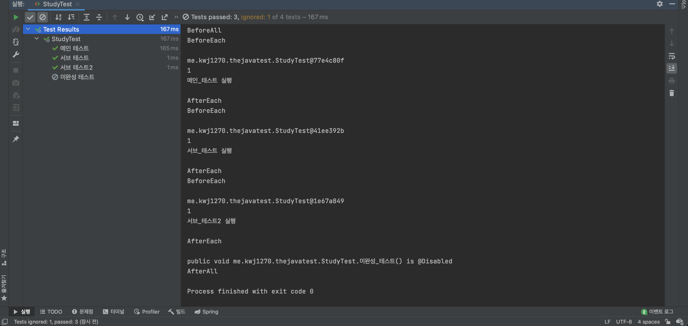

# junit-platform.properties    
                
동일한 설정에서 테스팅을 해야하는 테스트 클래스가 여럿있다고 가정한다.            
어느날, 설정을 바꿔야한다는 오더가 내려와 모든 테스트 클래스를 수정해야 하는 상황이 발생했다.   
          
하지만, 만약 테스트 클래스가 100개, 1000개, 10000개라면?        
그리고 이를 다 수작업으로 작업하다가 누락하거나 잘못된 값을 넣는다면?     
    
어찌보면 이 모든 것은 중복에 의해 발생된 상황이다.    
       
JUnit5 에서는 `properties/yml`을 통해 테스트 클래스에 대한 공통적인 설정을 지원해준다.            
   
# junit-platform.properties 만들기  
> JUnit 설정 파일로, 클래스패스 루트 (src/test/resources/)에 넣어두면 적용된다.    
       
1. test 디렉터리 하위에 `[new directory]`로 resources 생성            
2. resources 디렉터리 하위에 junit-platform.properties         
   
단, IntelliJ Community를 이용할 경우,          
`resources`에 대해서 `[Test Resources]`디렉토리로 인식을 하지 못하는 경우가 있다.             
이렇게 될 경우 해당 디렉토리를 클래스 패스로 사용을 하지 않기 때문에, 하위 파일들을 읽어오지 못한다.          

    
  
이를 해결하기 위해서는    
`[File]` -> `[Project Structure]` -> `[module]`에서     
`test` 밑에 있는 `resources` 디렉토리를 클릭 후 우측 상단의 `[Test Resources]`로 클릭하여 등록해준다.     

# junit-platform.properties 속성     
  
**properties 테스트를 위한, 테스트 클래스**   
```java
package me.kwj1270.thejavatest;

import org.junit.jupiter.api.*;

import static org.assertj.core.api.Assertions.*;

class StudyTest {

    int value = 0;

    int value = 0;

    @Order(3)
    @FastTest
    public void 메인_테스트() {
        Study actual = new Study(10);
        assertThat(actual.getLimit()).isGreaterThan(0);
        System.out.println();
        System.out.println(this);
        System.out.println(++value);
        System.out.println("메인_테스트 실행\n");

    }

    @Order(1)
    @SlowTest
    public void 서브_테스트() {
        System.out.println();
        System.out.println(this);
        System.out.println(++value);
        System.out.println("서브_테스트 실행\n");
    }

    @Order(2)
    @SlowTest
    public void 서브_테스트2() {
        System.out.println();
        System.out.println(this);
        System.out.println(++value);
        System.out.println("서브_테스트2 실행\n");
    }

    @Order(4)
    @Disabled
    @Test
    public void 미완성_테스트() {
        System.out.println();
        System.out.println(this);
        System.out.println(++value);
        System.out.println("미완성_테스트");
    }

    @BeforeAll
    static void BeforeAll_테스트() {
        System.out.println("BeforeAll");
    }

    @BeforeEach
    public void BeforeEach_테스트() {
        System.out.println("BeforeEach");
    }

    @AfterEach
    public void AfterEach_테스트() {
        System.out.println("AfterEach");
    }

    @AfterAll
    static void AfterAll_테스트() {
        System.out.println("AfterAll");
    }

}
```
   
## properties, MethodOrderer 설정 
기존, `@TestMethodOrder(MethodOrderer.오더클래스이름.class)`을 대신하는 프로퍼티 값이다.      
어노테이션과 마찬가지로, 아래와 같은 MethodOrderer 타입을 사용할 수 있다.            
       
* OrderAnnotation     
* MethodName    
* DisplayName     
* Random        
    
사용법은 `org.junit.jupiter.api.MethodOrderer$`뒤에 타입을 붙여주면 된다.    
    
```properties
junit.jupiter.testmethod.order.default=org.junit.jupiter.api.MethodOrderer$OrderAnnotation
# junit.jupiter.testinstance.lifecycle.default=per_class
# junit.jupiter.conditions.deactivate=org.junit.*DisabledCondition
# junit.jupiter.displayname.generator.default=org.junit.jupiter.api.DisplayNameGenerator$ReplaceUnderscores
# junit.jupiter.extensions.autodetection.enabled = true
```
   
      
        
테스트 클래스에는 `@TestMethodOrder(MethodOrderer.오더클래스이름.class)`를 정의하지 않았지만,        
`@Order`에 정의된 우선순위대로 테스트 메서드가 실행되는 것을 알 수 있다.       
     
## properties, LifeCycle 설정 
기존, `@TestInstance(TestInstance.Lifecycle.상수)`를 대신하는 프로퍼티 값이다.        
어노테이션과 마찬가지로 테스트 인스턴스 라이프사이클 설정할 수 있다.   
     
* per_class   
      
사용법은 `junit.jupiter.testinstance.lifecycle.default=per_class` 기술하면 된다.      
검색을 했을 때, `per_method`가 존재하는 지는 알기가 힘들어 우선 제외했는데 있을 경우 추가하겠다.         
     
```properties
# junit.jupiter.testmethod.order.default=org.junit.jupiter.api.MethodOrderer$OrderAnnotation
junit.jupiter.testinstance.lifecycle.default=per_class
# junit.jupiter.conditions.deactivate=org.junit.*DisabledCondition
# junit.jupiter.displayname.generator.default=org.junit.jupiter.api.DisplayNameGenerator$ReplaceUnderscores
# junit.jupiter.extensions.autodetection.enabled = true
```
   
       
      
테스트 클래스에는 `@TestInstance(TestInstance.Lifecycle.상수)`를 정의하지 않았지만,             
테스트 인스턴스가 클래스 단위로 1개만 생성되기에 해시값이 같고 value 값이 공용으로 사용된다는 것을 알 수 있다.      
   
## properties, Disabled 적용 설정    
테스트 클래스에 정의된 @Disabled 무시하고 테서트 메서드를 실행하는 프로퍼티 값이다.      
          
`junit.jupiter.conditions.deactivate = org.junit.*`에 사용할 수 있는 Condition 값은 아래와 같다.     
  
* DisabledCondition    
* DisabledIfCondition
* DisabledIfCondition
* DisabledOnJreCondition
* DisabledOnOsCondition
* DisabledForJreRangeCondition
* DisabledIfEnvironmentVariableCondition
* DisabledIfSystemPropertyCondition

해당 프로퍼티값을 넣으면 어노테이션 내부에 `@ExtendWith({Condition이름.class})`을 가진 어노테이션에 대해서        
테스트에서 제외하는 것을 무시하고 메서드를 실행시킨다.         
     
```properties
# junit.jupiter.testmethod.order.default=org.junit.jupiter.api.MethodOrderer$OrderAnnotation
# junit.jupiter.testinstance.lifecycle.default=per_class
junit.jupiter.conditions.deactivate=org.junit.*DisabledCondition
# junit.jupiter.displayname.generator.default=org.junit.jupiter.api.DisplayNameGenerator$ReplaceUnderscores
# junit.jupiter.extensions.autodetection.enabled = true
```
    
         
기존에 `@Disabled` 어노테이션을 선언한, `미완성_테스트` 메서드가 실행된 것을 알 수 있다.           
   

## properties, DisplayNameGenerator 설정
테스트 이름 표기 전략 설정

```properties
# junit.jupiter.testmethod.order.default=org.junit.jupiter.api.MethodOrderer$OrderAnnotation
# junit.jupiter.testinstance.lifecycle.default=per_class
# junit.jupiter.conditions.deactivate=org.junit.*DisabledCondition
junit.jupiter.displayname.generator.default=org.junit.jupiter.api.DisplayNameGenerator$ReplaceUnderscores
# junit.jupiter.extensions.autodetection.enabled = true
```
  
       

## properties, extensions 설정 

확장팩 자동 감지 기능
junit.jupiter.extensions.autodetection.enabled = true

```properties
# junit.jupiter.testmethod.order.default=org.junit.jupiter.api.MethodOrderer$OrderAnnotation
# junit.jupiter.testinstance.lifecycle.default=per_class
# junit.jupiter.conditions.deactivate=org.junit.*DisabledCondition
# junit.jupiter.displayname.generator.default=org.junit.jupiter.api.DisplayNameGenerator$ReplaceUnderscores
junit.jupiter.extensions.autodetection.enabled = true
```
