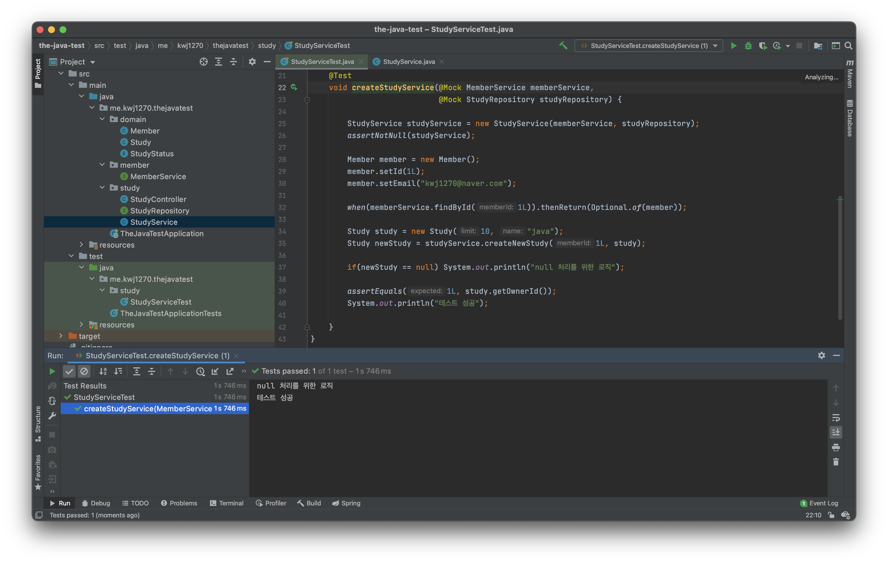
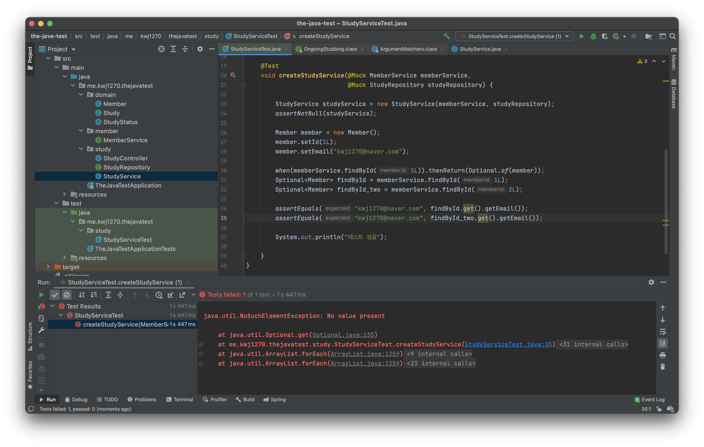
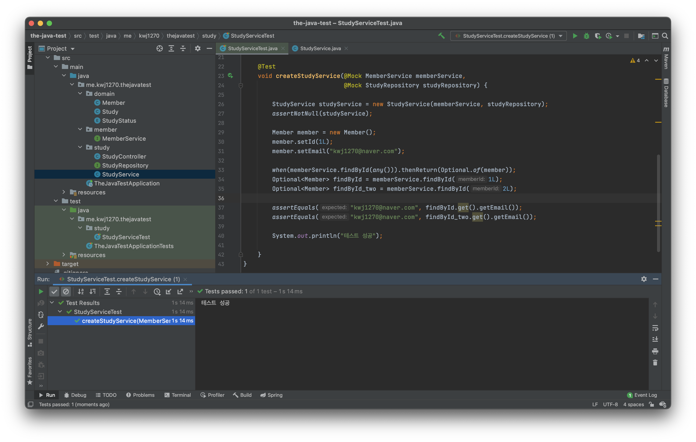
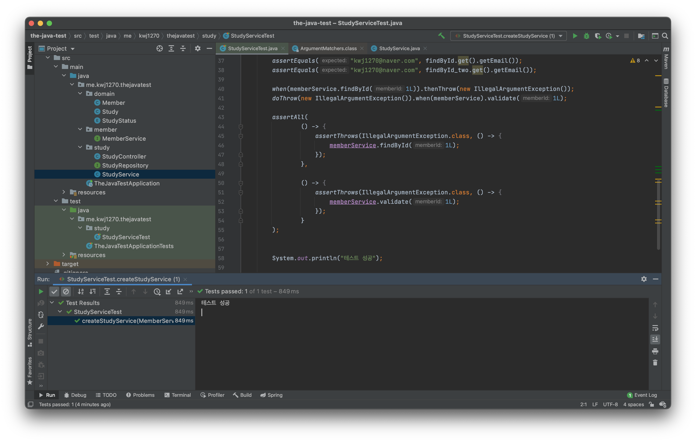

# Mock 객체 Stubbing
**Stubbing이란** `Mock`객체의 행동을 조작하는 것을 의미한다.    
    
`Mock`객체 메서드의 실제 반환 값은 아래와 같다.      
        
* 레퍼런스 타입 : NULL
* Optional 타입 : Optional.empty 리턴  
* Primitive 타입 : Primitive 타입의 기본 값(0,false 등등)     
* Collection 타입 : 비어있다.    
* void 타입 : 예외를 던지지 않고 아무런 일도 발생하지 않는다.       
    
# Stubbing    
테스트 코드를 작성하다 보면, `Mock` 객체의 특정 메서드를 호출해야 하는 상황이 발생하기도 번번히 한다.     
하지만, 위에서 보았듯이 `Mock` 객체는 '모형 객체'이므로 메서드는 아무런 동작을 하지 않는다.   
그렇다면 어떻게 해야할까? 우선, 아래 코드를 살펴보자    

**Stubbing 작업 전**
```java
package me.kwj1270.thejavatest.study;

import me.kwj1270.thejavatest.domain.Member;
import me.kwj1270.thejavatest.member.MemberService;
import org.junit.jupiter.api.Test;
import org.junit.jupiter.api.extension.ExtendWith;
import org.mockito.Mock;
import org.mockito.junit.jupiter.MockitoExtension;

import java.util.Optional;

import static org.mockito.Mockito.*;
import static org.junit.jupiter.api.Assertions.*;

@ExtendWith(MockitoExtension.class)
class StudyServiceTest {

    @Test
    void createStudyService(@Mock MemberService memberService,
                            @Mock StudyRepository studyRepository) {
        
        Optional<Member> optional = memberService.findById(1L);

        StudyService studyService = new StudyService(memberService, studyRepository);
        assertNotNull(studyService);
        System.out.println("테스트 성공");
    }
}
``` 
`memberService`를 이용해서 `Member` 클래스를 래핑하는 `Optional` 인스턴스를 가져온다.            
하지만, 앞서 정의한 내용을 봤듯이, `Mock`객체 메서드의 `Optional` 반환형은 `Optional.empty`이다.         
그렇기 때문에 값을 받아온다 한들 아무런 값이 없기에 이와 관련된 테스트는 더 이상 진행하기 어렵다.            
        
이 같은 상황에서 `Mock` 인스턴스에게 마치 실제 메서드를 호출한 것과 같은 `가짜 동작`을 넣어줄 수 있다.       
그리고 이러한 작업을 `Stubbing`이라 부른다.         
  
## when()   
```java
package me.kwj1270.thejavatest.study;

import me.kwj1270.thejavatest.domain.Member;
import me.kwj1270.thejavatest.domain.Study;
import me.kwj1270.thejavatest.member.MemberService;
import org.junit.jupiter.api.Test;
import org.junit.jupiter.api.extension.ExtendWith;
import org.mockito.Mock;
import org.mockito.junit.jupiter.MockitoExtension;

import java.util.Optional;

import static org.mockito.Mockito.*;
import static org.junit.jupiter.api.Assertions.*;

@ExtendWith(MockitoExtension.class)
class StudyServiceTest {

    @Test
    void createStudyService(@Mock MemberService memberService,
                            @Mock StudyRepository studyRepository) {

        StudyService studyService = new StudyService(memberService, studyRepository);
        assertNotNull(studyService);

        Member member = new Member();
        member.setId(1L);
        member.setEmail("kwj1270@naver.com");

        when(memberService.findById(1L)).thenReturn(Optional.of(member));

        Optional<Member> findById = memberService.findById(1L);
        assertEquals("kwj1270@naver.com", findById.get().getEmail());

        System.out.println("테스트 성공");
    }
}
```   
   
     

```java
when(memberService.findById(1L)).thenReturn(Optional.of(member));
```   
`Mockito` 클래스의 `static` 메서드인 `when()`을 이용해서 stubbing 작업을 만들 수 있다.     
`when()`메서드는 `Mock` 객체를 래핑한 `OngoingStubbing` 래퍼 클래스를 반환한다.         
위와 같은 경우는 `OngoingStubbing` 의 `.thenReturn()`를 이용해 메서드의 동작을 정의했다.       

```java
package me.kwj1270.thejavatest.study;

import me.kwj1270.thejavatest.domain.Member;
import me.kwj1270.thejavatest.domain.Study;
import me.kwj1270.thejavatest.member.MemberService;
import org.junit.jupiter.api.Test;
import org.junit.jupiter.api.extension.ExtendWith;
import org.mockito.Mock;
import org.mockito.junit.jupiter.MockitoExtension;

import java.util.Optional;

import static org.mockito.Mockito.*;
import static org.junit.jupiter.api.Assertions.*;

@ExtendWith(MockitoExtension.class)
class StudyServiceTest {

    @Test
    void createStudyService(@Mock MemberService memberService,
                            @Mock StudyRepository studyRepository) {

        StudyService studyService = new StudyService(memberService, studyRepository);
        assertNotNull(studyService);

        Member member = new Member();
        member.setId(1L);
        member.setEmail("kwj1270@naver.com");

        when(memberService.findById(1L)).thenReturn(Optional.of(member));
    
        Study study = new Study(10, "java");
        Study newStudy = studyService.createNewStudy(1L, study);
        
        if(newStudy == null) System.out.println("?");
    
        assertEquals(1L, study.getOwnerId());
        System.out.println("테스트 성공");
    
    }
}
```
          
      
`Stubbing`은 테스트 케이스 전 구간에 걸쳐 해당 메서드를 실행하는 값을 정의하는 것이다.       
그렇기 때문에, `studyService`의 `createNewStudy()`를 실행해도 정의한대로 동작한다.       

```java
    public Study createNewStudy(Long memberId, Study study) {
        Optional<Member> member = memberService.findById(memberId);
        if (!member.isPresent()) {
            throw new IllegalArgumentException("Member doesn't exist for id: '" + memberId + "'");
        }
        study.setOwnerId(memberId);
        Study newstudy = repository.save(study);
        return newstudy;
    }
```    
`studyService`의 `createNewStudy()`를 보게되면,         
의존성 주입받았던, `MemberService` 인스턴스의 `findById()`를 호출하고 있다.        
의존성 주입받았던, `MemberService` 인스턴스는 앞서 `when()`으로 지정한 인스턴스이다.    
그렇기 때문에 다른 흐름이지만, 이정에 정의해 두었던 `Stubbing` 기능이 동작한 것이다.      
                
참고로 `if(newStudy == null)`로 null 처리를 해준 이유는          
`newStudy`가 참조하는 `createNewStudy`의 `Study` 반환 값은          
`Mock` 객체인 `StudyRepository`의 `save()` 메서드의 반환 값이기 때문이다.         
마찬가지로 `Stubbing` 처리를 하지 않은 `Mock`객체의 반환값이기 때문에 null이 리턴되었다.    

## any()   
```java
        when(memberService.findById(1L)).thenReturn(Optional.of(member));
```
기존에 우리는, `when()`을 호출하면서 메서드에 특정 파라미터 값을 넘겨주었다.      
하지만, 이 같은 방법을 사용하게되면 특정 파리미터에 대한 `Stubbing`이 이루어진다.    

```java
package me.kwj1270.thejavatest.study;

import me.kwj1270.thejavatest.domain.Member;
import me.kwj1270.thejavatest.domain.Study;
import me.kwj1270.thejavatest.member.MemberService;
import org.junit.jupiter.api.Test;
import org.junit.jupiter.api.extension.ExtendWith;
import org.mockito.Mock;
import org.mockito.junit.jupiter.MockitoExtension;

import java.util.Optional;

import static org.mockito.Mockito.*;
import static org.junit.jupiter.api.Assertions.*;

@ExtendWith(MockitoExtension.class)
class StudyServiceTest {

    @Test
    void createStudyService(@Mock MemberService memberService,
                            @Mock StudyRepository studyRepository) {

        StudyService studyService = new StudyService(memberService, studyRepository);
        assertNotNull(studyService);

        Member member = new Member();
        member.setId(1L);
        member.setEmail("kwj1270@naver.com");

        when(memberService.findById(1L)).thenReturn(Optional.of(member));
        Optional<Member> findById = memberService.findById(1L);
        Optional<Member> findById_two = memberService.findById(2L);

        assertEquals("kwj1270@naver.com", findById.get().getEmail());
        assertEquals("kwj1270@naver.com", findById_two.get().getEmail());

        System.out.println("테스트 성공");

    }
}
```   
   
  
위 결과를 보면 알수 있듯이, 다른 파라미터를 넣었을 경우 `Stubbing`이 되지 않았음을 알 수 있다.   
그렇다면, 파라미터의 값은 범위가 엄청 넓고 많은데 그것을 일일히 `Stubbing`해야 할까?    
물론, 당연히 아니다 😉     
`Mockito` 클래스의 `static` 메서드인 `any-`타입 메서드를 사용하면 된다.      
    
`Mockito` 클래스의 `any-` 타입 메서드는 매개변수의 범위를 대신해주며      
이름 그대로 아무값이나 들어와도 `Stubbing`을 할 수 있게 만들어주는 유용한 메서드이다.       

특정 자료형에 따라 메서드가 세분화되어 나누어져있으며, `any자료형()`형태로 되어있다.   

```java
package me.kwj1270.thejavatest.study;

import me.kwj1270.thejavatest.domain.Member;
import me.kwj1270.thejavatest.domain.Study;
import me.kwj1270.thejavatest.member.MemberService;
import org.junit.jupiter.api.Test;
import org.junit.jupiter.api.extension.ExtendWith;
import org.mockito.Mock;
import org.mockito.junit.jupiter.MockitoExtension;

import java.util.Optional;

import static org.mockito.Mockito.*;
import static org.junit.jupiter.api.Assertions.*;

@ExtendWith(MockitoExtension.class)
class StudyServiceTest {

    @Test
    void createStudyService(@Mock MemberService memberService,
                            @Mock StudyRepository studyRepository) {

        StudyService studyService = new StudyService(memberService, studyRepository);
        assertNotNull(studyService);

        Member member = new Member();
        member.setId(1L);
        member.setEmail("kwj1270@naver.com");

        when(memberService.findById(any())).thenReturn(Optional.of(member));
        Optional<Member> findById = memberService.findById(1L);
        Optional<Member> findById_two = memberService.findById(2L);

        assertEquals("kwj1270@naver.com", findById.get().getEmail());
        assertEquals("kwj1270@naver.com", findById_two.get().getEmail());

        System.out.println("테스트 성공");

    }
}
```
      
   
`any()`와 같이 이러한 작업을 하는 요소를 `Argument matchers`라 부르며,      
더 자세한 내용은 [레퍼런스](Argument matchers)를 참고하자 (some-()도 있다)     

## returnThrow() 와 doThrow()     
Stubbing 했을 때 어떤 값을 리턴하는게 아니라 **예외를 던지는 작업도 할 수 있다.**         
   
```java
package me.kwj1270.thejavatest.study;

import me.kwj1270.thejavatest.domain.Member;
import me.kwj1270.thejavatest.domain.Study;
import me.kwj1270.thejavatest.member.MemberService;
import org.junit.jupiter.api.Test;
import org.junit.jupiter.api.extension.ExtendWith;
import org.mockito.Mock;
import org.mockito.junit.jupiter.MockitoExtension;

import java.util.Optional;

import static org.mockito.Mockito.*;
import static org.junit.jupiter.api.Assertions.*;

@ExtendWith(MockitoExtension.class)
class StudyServiceTest {

    @Test
    void createStudyService(@Mock MemberService memberService,
                            @Mock StudyRepository studyRepository) {

        StudyService studyService = new StudyService(memberService, studyRepository);
        assertNotNull(studyService);

        Member member = new Member();
        member.setId(1L);
        member.setEmail("kwj1270@naver.com");

        when(memberService.findById(any())).thenReturn(Optional.of(member));
        Optional<Member> findById = memberService.findById(1L);
        Optional<Member> findById_two = memberService.findById(2L);

        assertEquals("kwj1270@naver.com", findById.get().getEmail());
        assertEquals("kwj1270@naver.com", findById_two.get().getEmail());

        when(memberService.findById(1L)).thenThrow(new IllegalArgumentException());
        doThrow(new IllegalArgumentException()).when(memberService).validate(1L);

        assertAll(
                () -> {
                    assertThrows(IllegalArgumentException.class, () -> {
                        memberService.findById(1L);
                    });
                },

                () -> {
                    assertThrows(IllegalArgumentException.class, () -> {
                        memberService.validate(1L);
                    });
                }
        );


        System.out.println("테스트 성공");

    }
}
```
  

이전 Junit에서 배웠던, assertAll과 assertThrows을 이용해서 예외테스팅을 진행해보았다. 
결과에서 알 수 있듯이 테스팅은 통과했고 우리는 2가지 경우를 함께 살펴보았다.   
      
* `when(Mock인스턴스의 특정 메서드).thenThrow()`: 반환형이 있는 경우에 사용한다.          
* `doThrow(new Exception클래스).when(Mock인스턴스).특정메서드()`: 반환형이 void인 경우에 사용한다.      
  
그리고 위 예시에서는 특정 값을 기준으로 했지만,   
여러 값을 한번에 처리하고 싶다면 앞서 배웠던 `Argument matchers` 를 이용하면 된다.  
    
## 체이닝 기법을 이용하기     
Stubbing 진해을 위해 앞서, `thenReturn()`과 `thenThrow()`를 사용했다.     
하지만, 메서드를 살펴보면 `OngoingStubbing` 인스턴스를 리턴하기에 우리는 체이닝 기법을 이용할 수 있다.      
더불어, **호출되는 순서가 지정되어 있어 같은 배개변수라도 매번 다른 값을 행동하도록 조작할 수 있다.**             

```java
package me.kwj1270.thejavatest.study;

import me.kwj1270.thejavatest.domain.Member;
import me.kwj1270.thejavatest.member.MemberService;
import org.junit.jupiter.api.Test;
import org.junit.jupiter.api.extension.ExtendWith;
import org.mockito.Mock;

import static org.mockito.Mockito.*;

import org.mockito.junit.jupiter.MockitoExtension;

import java.util.Optional;

import static org.junit.jupiter.api.Assertions.*;

@ExtendWith(MockitoExtension.class)
class StudyServiceTest {

    @Test
    void createStudyService(@Mock MemberService memberService,
                            @Mock StudyRepository studyRepository) {

        StudyService studyService = new StudyService(memberService, studyRepository);
        assertNotNull(studyService);

        Member member = new Member();
        member.setId(1L);
        member.setEmail("kwj1270@naver.com");

        when(memberService.findById(any()))
                .thenReturn(Optional.of(member))
                .thenThrow(new RuntimeException())
                .thenReturn(Optional.empty());

        Optional<Member> findById = memberService.findById(1L);
        assertEquals("kwj1270@naver.com", findById.get().getEmail());

        assertThrows(RuntimeException.class, () -> {
            memberService.findById(2L);
        });

        assertEquals(Optional.empty(), memberService.findById(3L));
        System.out.println("테스트 성공");
    }
}
```


   

