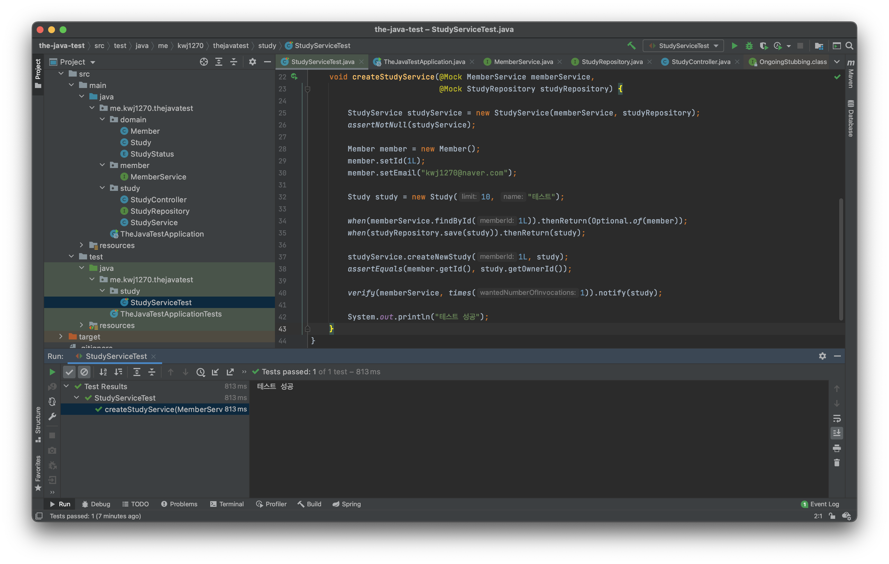
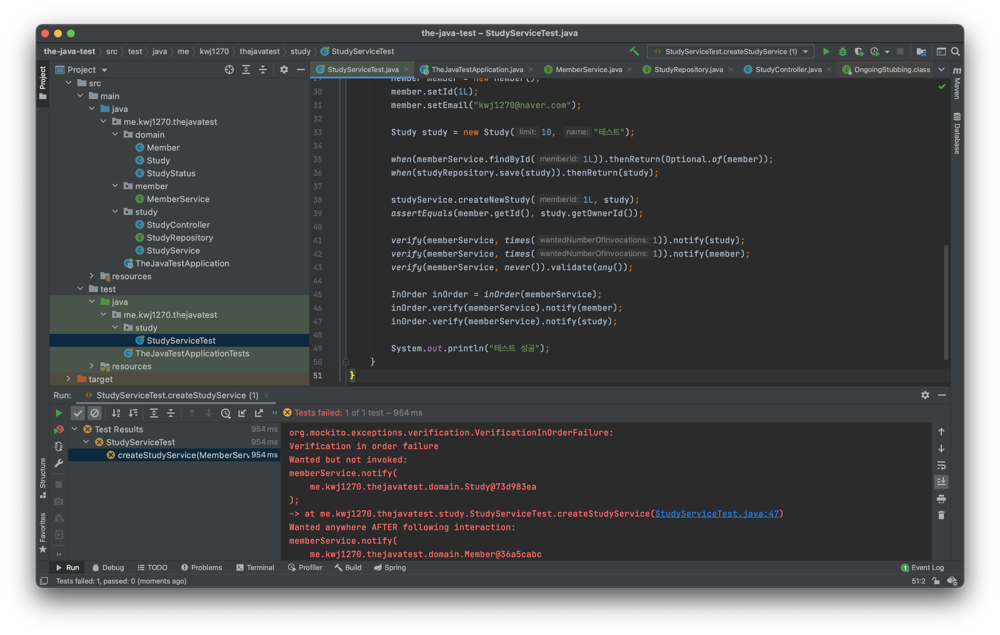

# Mock 객체 확인
Mock 객체에 어떤 일이 일어나는지 확인해보자   

## verify()   
`Mock 객체`의 메서드가 되었는지 호출했는지 확인 및 검증을 할 수 없을까?            
`verify()`는 이런 `Mock`객체의 활동에 대해서 확인 및 검증을 할 수 있는 메서드다.          
    
```java
package me.kwj1270.thejavatest.study;

import me.kwj1270.thejavatest.domain.Member;
import me.kwj1270.thejavatest.domain.Study;
import me.kwj1270.thejavatest.member.MemberService;

import java.util.Optional;

public class StudyService {

    private final MemberService memberService;
    private final StudyRepository repository;

    public StudyService(MemberService memberService, StudyRepository repository) {
        assert memberService != null;           // assert 키워드를 사용하면, null임을 확인할 수 있다. (AssertException)
        assert repository != null;
        this.memberService = memberService;
        this.repository = repository;
    }

    public Study createNewStudy(Long memberId, Study study) {
        Optional<Member> member = memberService.findById(memberId);
        if (!member.isPresent()) {
            throw new IllegalArgumentException("Member doesn't exist for id: '" + memberId + "'");
        }
        study.setOwnerId(memberId);
        Study newstudy = repository.save(study);
        memberService.notify(newstudy);
        return newstudy;
    }

}
```
`memberService.notify(newstudy)`를 통해 스터디에 관심있는 있는 사람들에게 알림을 주는 서비스를 추가했다.                  
그리고`memberService`는 Mock 객체이므로 `notify(newstudy)`은 아무런 동작도 하지 않을 것이다.(void)                   
하지만, 우리는 Stubbig에 대해서 공부하는 것이 아니라 이 `notify(newstudy)`가 호출되었는지 검증할 것이다.     
     
```java
package me.kwj1270.thejavatest.study;

import me.kwj1270.thejavatest.domain.Member;
import me.kwj1270.thejavatest.domain.Study;
import me.kwj1270.thejavatest.member.MemberService;
import org.junit.jupiter.api.Test;
import org.junit.jupiter.api.extension.ExtendWith;
import org.mockito.Mock;

import static org.mockito.Mockito.*;

import org.mockito.junit.jupiter.MockitoExtension;

import java.util.Optional;

import static org.junit.jupiter.api.Assertions.*;

@ExtendWith(MockitoExtension.class)
class StudyServiceTest {

    @Test
    void createStudyService(@Mock MemberService memberService,
                            @Mock StudyRepository studyRepository) {

        StudyService studyService = new StudyService(memberService, studyRepository);
        assertNotNull(studyService);

        Member member = new Member();
        member.setId(1L);
        member.setEmail("kwj1270@naver.com");

        Study study = new Study(10, "테스트");

        when(memberService.findById(1L)).thenReturn(Optional.of(member));
        when(studyRepository.save(study)).thenReturn(study);

        studyService.createNewStudy(1L, study);
        assertEquals(member.getId(), study.getOwnerId());

        verify(memberService, times(1)).notify(study);
        
        System.out.println("테스트 성공");
    }
}
``` 
      
    
```java
verify(Mock 인스턴스, times(카운트)).Mock_인스턴스_메서드(특정매개변수);
```
        
`verify(memberService, times(1)).notify(study);`를 통해 notify() 메서드의 호출여부에 대해 검증할 수 있다.   
`times()`는 지정한 메서드가 **`정확히 몇 번 호출되었는지`** 를 그 갯수의 기준을 정의하는 메서드이다.           
이 뒤에 오는 매개변수는 `Stubbing`과 마찬가지로 특정 매개변수를 처리하는 메서드를 지정하는 것이다.       
그렇기에, `any()`, `some()` 같은 `Argument Matchers` 또한 사용할 수 있다.  
         
단, 미리 Stubbing을 정의하는 `when()`과 다르게               
`verify()` 메서드를 실행하기 전에 **했었는지**에 대한 경험에 대해서 묻고 있다.       
그렇기에 `verify()`를 사용하고자 한다면 **로직이 실행된 후에 기술해주는 것이 좋다.**         
그리고 **`정확히 몇 번 호출 되었는지`** 를 검증하는 것이기에 **이보다 적거나 많게 실행하면 에러가 발생한다.**     

```java
package me.kwj1270.thejavatest.study;

import me.kwj1270.thejavatest.domain.Member;
import me.kwj1270.thejavatest.domain.Study;
import me.kwj1270.thejavatest.member.MemberService;
import org.junit.jupiter.api.Test;
import org.junit.jupiter.api.extension.ExtendWith;
import org.mockito.Mock;

import static org.mockito.Mockito.*;

import org.mockito.junit.jupiter.MockitoExtension;

import java.util.Optional;

import static org.junit.jupiter.api.Assertions.*;

@ExtendWith(MockitoExtension.class)
class StudyServiceTest {

    @Test
    void createStudyService(@Mock MemberService memberService,
                            @Mock StudyRepository studyRepository) {

        StudyService studyService = new StudyService(memberService, studyRepository);
        assertNotNull(studyService);

        Member member = new Member();
        member.setId(1L);
        member.setEmail("kwj1270@naver.com");

        Study study = new Study(10, "테스트");

        when(memberService.findById(1L)).thenReturn(Optional.of(member));
        when(studyRepository.save(study)).thenReturn(study);

        studyService.createNewStudy(1L, study);
        assertEquals(member.getId(), study.getOwnerId());

        verify(memberService, times(1)).notify(study);
        verify(memberService, never()).validate(any());
        System.out.println("테스트 성공");
    }
}
```      
      
  
`times()` 외에도 `never()` 메서드를 사용할 수 있다.       
`never()` 메서드는 `times()`와 반대로 뒤에 따라오는 메서드를 실행하지 않아야 하는 경우를 테스트하는 메서드이다.   

##

```java
package me.kwj1270.thejavatest.study;

import me.kwj1270.thejavatest.domain.Member;
import me.kwj1270.thejavatest.domain.Study;
import me.kwj1270.thejavatest.member.MemberService;
import org.junit.jupiter.api.Test;
import org.junit.jupiter.api.extension.ExtendWith;
import org.mockito.InOrder;
import org.mockito.Mock;

import static org.mockito.Mockito.*;

import org.mockito.junit.jupiter.MockitoExtension;

import java.util.Optional;

import static org.junit.jupiter.api.Assertions.*;

@ExtendWith(MockitoExtension.class)
class StudyServiceTest {

    @Test
    void createStudyService(@Mock MemberService memberService,
                            @Mock StudyRepository studyRepository) {

        StudyService studyService = new StudyService(memberService, studyRepository);
        assertNotNull(studyService);

        Member member = new Member();
        member.setId(1L);
        member.setEmail("kwj1270@naver.com");

        Study study = new Study(10, "테스트");

        when(memberService.findById(1L)).thenReturn(Optional.of(member));
        when(studyRepository.save(study)).thenReturn(study);

        studyService.createNewStudy(1L, study);
        assertEquals(member.getId(), study.getOwnerId());

        verify(memberService, times(1)).notify(study);
        verify(memberService, times(1)).notify(member);
        verify(memberService, never()).validate(any());

        verifyNoMoreInteractions(memberService);
        
        System.out.println("테스트 성공");
    }


}
```
## InOrder          
여태까지는 `verify()` 메서드를 통해 메서드의 사용 횟수에 대해서 검증을 했다.      
단, `verify()` 메서드는 단순히 횟수에 대해서만 검증을 하기에 어떤 로직으로 실행 되었는지까지는 검증 못한다.      
              
예를들어 1번 메서드 다음에, 2번 메서드를 호출한다 가정한다.             
`verify()`메서드를 통해 1번 메서드와 2번 메서드의 사용횟수를 검증을 한다.            
그런데 갑작스런 요구사항 변화로 2번 메서드 다음, 1번 메서드를 호출하는 것으로 바뀌었다.          
하지만, 개발자는 이 요구사항을 통해 코드 수정을 깜빡하고 테스트를 진행했지만 테스트는 성공적으로 나왔다.      
왜냐하면 `verify()`메서드는 횟수만 검증하기 때문이다.      

이런 경우 우리는 `Mock`객체가 메서드를 실행하는 순서에 대해서도 검증을 할 필요가 있다.      
그리고 정말 다행스럽게도 `Mockito`에서는 `inOrder()`메서드를 제공하고          
`inOrder()`메서드에서 리턴되는 `InOrder` 인스턴스를 활용하면 된다.           
       
```java
package me.kwj1270.thejavatest.study;

import me.kwj1270.thejavatest.domain.Member;
import me.kwj1270.thejavatest.domain.Study;
import me.kwj1270.thejavatest.member.MemberService;

import java.util.Optional;

public class StudyService {

    private final MemberService memberService;
    private final StudyRepository repository;

    public StudyService(MemberService memberService, StudyRepository repository) {
        assert memberService != null;           // assert 키워드를 사용하면, null임을 확인할 수 있다. (AssertException)
        assert repository != null;
        this.memberService = memberService;
        this.repository = repository;
    }

    public Study createNewStudy(Long memberId, Study study) {
        Optional<Member> member = memberService.findById(memberId);
        if (!member.isPresent()) {
            throw new IllegalArgumentException("Member doesn't exist for id: '" + memberId + "'");
        }
        study.setOwnerId(memberId);
        Study newstudy = repository.save(study);
        memberService.notify(newstudy);
        memberService.notify(member.get());
        return newstudy;
    }

}
```
```java
package me.kwj1270.thejavatest.study;

import me.kwj1270.thejavatest.domain.Member;
import me.kwj1270.thejavatest.domain.Study;
import me.kwj1270.thejavatest.member.MemberService;
import org.junit.jupiter.api.Test;
import org.junit.jupiter.api.extension.ExtendWith;
import org.mockito.InOrder;
import org.mockito.Mock;

import static org.mockito.Mockito.*;

import org.mockito.junit.jupiter.MockitoExtension;

import java.util.Optional;

import static org.junit.jupiter.api.Assertions.*;

@ExtendWith(MockitoExtension.class)
class StudyServiceTest {

    @Test
    void createStudyService(@Mock MemberService memberService,
                            @Mock StudyRepository studyRepository) {

        StudyService studyService = new StudyService(memberService, studyRepository);
        assertNotNull(studyService);

        Member member = new Member();
        member.setId(1L);
        member.setEmail("kwj1270@naver.com");

        Study study = new Study(10, "테스트");

        when(memberService.findById(1L)).thenReturn(Optional.of(member));
        when(studyRepository.save(study)).thenReturn(study);

        studyService.createNewStudy(1L, study);
        assertEquals(member.getId(), study.getOwnerId());

        verify(memberService, times(1)).notify(study);
        verify(memberService, times(1)).notify(member);
        verify(memberService, never()).validate(any());

        InOrder inOrder = inOrder(memberService);
        inOrder.verify(memberService).notify(study);
        inOrder.verify(memberService).notify(member);

        System.out.println("테스트 성공");
    }
}
```

   
         
```java
     // inOrder(Mock 인스턴스)   
     
        InOrder inOrder = inOrder(memberService);

     // InOrder인스턴스.verify(Mock인스턴스).검증할 Mock 인스턴스의 메서드(특정 파라미터)   
    
        inOrder.verify(memberService).notify(study);
        inOrder.verify(memberService).notify(member);
```           
`InOrder` 인스턴스의 `verify()`메서드를 통해 실행 순서를 검증할 수 있다.                          
물론, 여기서 사용되는 `verify()`는 횟수를 검증하는 `Mockito`의 `verify()`와는 다르다.                     
단, 형식은 비슷한데 `verify()`의 매개변수로 `Mock` 인스턴스를 넣어주고, 이후 검증할 메서드를 등록한다.       
    
꼭 `Mock` 인스턴스가 호출하는 모든 메서드를 기술할 필요가 없으며   
단순히 내가 사용하고자 하는 메서드만을 기술해주면 된다.   
  
예를 들어 아래와 같은 순서로 메서드를 호출한다 가정한다.     

1. A 메서드
2. B 메서드
3. C 메서드 

순서에 맞게끔이라 하면, A,B,C 메서드 모두 호출해야 한다고 생각할 수 있지만,   
`verify()`에 `A`, `C`를 지정해줘도 되고, `B`, `C` 를 지정해줘도 정상동작한다.       
  
* `memberService.findById(memberId);`    
* `memberService.notify(newstudy);`       
* `memberService.notify(member.get());`    

예시 코드 같은 경우 위와 같은 순서로 동작하지만,     
       
* `notify(newstudy);`   
* `notify(member.get());`
             
위와 같이 2개의 메서드를 정의를 해줬어도 테스트가 성공 했고        
이로 인해, 꼭 모든 메서드를 기술하지 않아도 되는 것임을 알 수 있다.              
          
**`verify()`순서를 뒤바꾼 코드**         
```java
package me.kwj1270.thejavatest.study;

import me.kwj1270.thejavatest.domain.Member;
import me.kwj1270.thejavatest.domain.Study;
import me.kwj1270.thejavatest.member.MemberService;
import org.junit.jupiter.api.Test;
import org.junit.jupiter.api.extension.ExtendWith;
import org.mockito.InOrder;
import org.mockito.Mock;

import static org.mockito.Mockito.*;

import org.mockito.junit.jupiter.MockitoExtension;

import java.util.Optional;

import static org.junit.jupiter.api.Assertions.*;

@ExtendWith(MockitoExtension.class)
class StudyServiceTest {

    @Test
    void createStudyService(@Mock MemberService memberService,
                            @Mock StudyRepository studyRepository) {

        StudyService studyService = new StudyService(memberService, studyRepository);
        assertNotNull(studyService);

        Member member = new Member();
        member.setId(1L);
        member.setEmail("kwj1270@naver.com");

        Study study = new Study(10, "테스트");

        when(memberService.findById(1L)).thenReturn(Optional.of(member));
        when(studyRepository.save(study)).thenReturn(study);

        studyService.createNewStudy(1L, study);
        assertEquals(member.getId(), study.getOwnerId());

        verify(memberService, times(1)).notify(study);
        verify(memberService, times(1)).notify(member);
        verify(memberService, never()).validate(any());

        InOrder inOrder = inOrder(memberService);
        inOrder.verify(memberService).notify(member);
        inOrder.verify(memberService).notify(study);

        System.out.println("테스트 성공");
    }
}
```
   
        
위 결과를 통해 순서를 뒤 바꾸었을 경우 테스트가 실패한다는 것을 알 수 있고       
`InOreder`는 **메서드의 실행 순서를 검증**한다는 것을 알 수 있다.          
